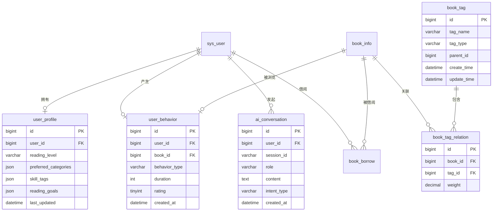

# 图书管理系统 V2.0 产品需求文档 (PRD)

**版本信息**
- 文档版本：V1.0
- 产品版本：V2.0
- 创建日期：2026-04-28
- 文档状态：草稿

---

## 目录

- [1. 产品概述](#1-产品概述)
- [2. 背景与目标](#2-背景与目标)
- [3. 目标用户](#3-目标用户)
- [4. 核心功能需求](#4-核心功能需求)
- [5. 非功能性需求](#5-非功能性需求)
- [6. 数据模型设计](#6-数据模型设计)
- [7. 技术架构设计](#7-技术架构设计)
- [8. API 接口设计](#8-api-接口设计)
- [9. 界面设计](#9-界面设计)
- [10. 实施计划](#10-实施计划)
- [11. 风险与应对](#11-风险与应对)

---

## 1. 产品概述

### 1.1 产品定位

**图书管理系统 V2.0** 是在 V1.0 基础上的智能化升级版本，从传统的图书借阅管理系统升级为智能化的个人阅读助手。系统通过集成大语言模型（LLM）和推荐算法，为用户提供智能问答、个性化推荐、阅读画像等智能化服务。

### 1.2 产品愿景

成为用户信赖的智能阅读顾问，通过 AI 技术帮助用户：
- 快速找到最适合的书籍
- 科学规划学习路径
- 持续提升个人能力
- 享受阅读乐趣

### 1.3 核心价值主张

| 用户价值 | 描述 |
|---------|------|
| 智能化搜索 | 用自然语言描述需求，AI 理解并推荐最合适的书 |
| 个性化推荐 | 基于阅读历史和行为，持续优化推荐准确度 |
| 场景化服务 | 针对学习、成长、阅读等不同场景提供精准建议 |
| 阅读追踪 | 记录阅读行为，构建个人阅读画像 |

---

## 2. 背景与目标

### 2.1 项目背景

V1.0 版本已实现基础的图书管理功能，包括：
- 用户权限管理（管理员/读者）
- 图书信息的增删改查
- 借阅归还流程
- 基础统计分析

**存在的问题**：
1. 用户搜索依赖精确关键词匹配，无法理解自然语言查询
2. 无推荐功能，用户需要主动搜索，发现效率低
3. 缺乏用户画像，无法提供个性化服务
4. 交互方式传统，不符合现代用户习惯

### 2.2 升级目标

#### 2.2.1 业务目标

| 指标 | V1.0 基线 | V2.0 目标 | 提升幅度 |
|------|----------|----------|---------|
| 用户搜索成功率 | 45% | 75% | +67% |
| 平均搜索耗时 | 120秒 | 40秒 | -67% |
| 用户周活跃度 | 25% | 45% | +80% |
| 借阅转化率 | 15% | 30% | +100% |
| 用户满意度（NPS） | 30 | 50 | +67% |

#### 2.2.2 产品目标

1. **智能化能力**
   - 实现自然语言查询理解
   - 构建基于 AI 的推荐引擎
   - 建立用户画像体系

2. **用户体验**
   - 提供对话式交互界面
   - 减少用户操作步骤
   - 提升响应速度

3. **技术能力**
   - 集成大语言模型
   - 接入向量数据库
   - 建立可扩展的 AI 服务架构

### 2.3 适用场景

**场景 1：技能学习**
> 用户："我最近在学 Python，有没有适合入门的书？"
> 系统：识别技能学习场景 → 分析用户水平 → 推荐入门级 Python 书籍

**场景 2：问题求助**
> 用户："我遇到了职业瓶颈，想提升管理能力，推荐几本书"
> 系统：识别问题场景 → 提取关键词（职业瓶颈、管理能力） → 推荐管理学经典

**场景 3：文学阅读**
> 用户："想看一些关于人生意义的经典文学作品"
> 系统：识别文学场景 → 推荐哲学/文学类经典书籍

**场景 4：兴趣探索**
> 用户："随便给我推荐几本最近热门的书"
> 系统：基于热门度 + 个性化偏好 → 推荐热门图书

---

## 3. 目标用户

### 3.1 用户画像

#### 用户类型 A：技术学习者

| 属性 | 描述 |
|------|------|
| 年龄 | 20-35岁 |
| 职业 | 程序员、学生、技术从业者 |
| 特征 | 主动学习新技术，需要系统性入门书籍 |
| 痛点 | 不知道该选哪本书，担心买错书浪费时间 |
| 需求 | 快速找到适合当前水平的入门/进阶书籍 |

#### 用户类型 B：职场进阶者

| 属性 | 描述 |
|------|------|
| 年龄 | 25-40岁 |
| 职业 | 中层管理者、职场白领 |
| 特征 | 遇到职业瓶颈，希望通过阅读提升能力 |
| 痛点 | 时间有限，需要高效的知识获取方式 |
| 需求 | 针对性推荐解决具体问题的书籍 |

#### 用户类型 C：文学爱好者

| 属性 | 描述 |
|------|------|
| 年龄 | 18-50岁 |
| 职业 | 各行业 |
| 特征 | 喜欢阅读文学作品，追求精神享受 |
| 痛点 | 书籍选择困难，依赖推荐 |
| 需求 | 发现高质量文学作品，获得阅读灵感 |

#### 用户类型 D：图书馆管理员

| 属性 | 描述 |
|------|------|
| 年龄 | 25-45岁 |
| 特征 | 负责图书采购、借阅管理 |
| 痛点 | 采购决策依赖经验，缺乏数据支持 |
| 需求 | 了解用户偏好，优化采购决策 |

### 3.2 用户旅程

```
┌─────────────────────────────────────────────────────────────┐
│                      用户旅程图                               │
├─────────────────────────────────────────────────────────────┤
│                                                              │
│  登录系统  →  使用智能助手  →  获取推荐  →  借阅图书  →  阅读  │
│      ↓           ↓              ↓           ↓          ↓      │
│  记录登录     自然语言对话    选择书籍    更新库存   行为追踪  │
│  更新画像     意图识别        个性化展示  借阅记录   画像更新  │
│                                                              │
└─────────────────────────────────────────────────────────────┘
```

---

## 4. 核心功能需求

### 4.1 功能架构图

```
┌─────────────────────────────────────────────────────────────────┐
│                       图书管理系统 V2.0                         │
├─────────────────────────────────────────────────────────────────┤
│                                                                 │
│  ┌──────────────┐  ┌──────────────┐  ┌──────────────┐         │
│  │  智能问答    │  │  个性化推荐  │  │  用户画像    │         │
│  └──────────────┘  └──────────────┘  └──────────────┘         │
│         ↓                  ↓                  ↓               │
│  ┌─────────────────────────────────────────────────────┐       │
│  │                  推荐引擎层                           │       │
│  │  ┌──────────┐  ┌──────────┐  ┌──────────┐         │       │
│  │  │内容推荐  │  │协同过滤  │  │混合推荐  │         │       │
│  │  └──────────┘  └──────────┘  └──────────┘         │       │
│  └─────────────────────────────────────────────────────┘       │
│         ↓                                                    │
│  ┌─────────────────────────────────────────────────────┐       │
│  │                  AI 服务层                            │       │
│  │  ┌──────────┐  ┌──────────┐  ┌──────────┐         │       │
│  │  │意图识别  │  │对话管理  │  │向量化服务│         │       │
│  │  └──────────┘  └──────────┘  └──────────┘         │       │
│  └─────────────────────────────────────────────────────┘       │
│         ↓                                                    │
│  ┌─────────────────────────────────────────────────────┐       │
│  │              V1.0 基础功能层                           │       │
│  │  图书管理  │  借阅管理  │  用户管理  │  统计分析     │       │
│  └─────────────────────────────────────────────────────┘       │
│                                                                 │
└─────────────────────────────────────────────────────────────────┘
```

### 4.2 智能问答功能 (P0 - 最高优先级)

#### 4.2.1 功能描述

提供基于自然语言的智能对话界面，用户可以用日常语言描述需求，系统通过 LLM 理解意图并给出推荐。

#### 4.2.2 用户故事

| 角色 | 用户故事 | 优先级 |
|------|---------|--------|
| 读者 | 作为一个读者，我希望用自然语言描述我需要什么书，这样我就不用思考关键词 | P0 |
| 读者 | 作为一个读者，我希望系统能记住我之前的对话，方便追问 | P0 |
| 读者 | 作为一个读者，我希望推荐结果有说明理由，让我理解推荐逻辑 | P1 |
| 管理员 | 作为一个管理员，我希望查看用户的对话记录，了解用户需求 | P2 |

#### 4.2.3 功能详情

**对话入口**
- 位置：首页顶部「智能助手」按钮
- 快捷入口：[技能学习]、[问题求助]、[文学推荐]、[随便看看]

**对话功能**
- 支持自然语言输入（文本）
- 支持多轮对话，保持上下文
- 支持快捷选择推荐场景
- 推荐结果包含：书籍信息、推荐理由、相关操作按钮

**推荐场景识别**
```
意图类型分类：
├── skill_learning      # 技能学习（Python、数据分析等）
├── problem_solving     # 问题解决（职业瓶颈、沟通障碍等）
├── literature_reading   # 文学阅读（人生意义、经典小说等）
├── casual_browsing     # 随便看看（热门、新书上架）
└── general_inquiry     # 通用查询（作者、分类等）
```

**对话流程**

```
用户输入 → 意图识别 → 实体提取 → 查询构建 → 推荐执行 → 结果生成
   ↓         ↓          ↓          ↓          ↓          ↓
 自然语言  识别场景   提取关键词  结构化查询  多源推荐   格式化响应
           提取意图   分析难度   标签匹配    个性化排序  添加推荐理由
```

#### 4.2.4 交互示例

**示例 1：技能学习场景**

```
[用户] 我最近在学 Python，有没有适合入门的书？

[AI] 好的，为您推荐以下 Python 入门书籍：

📚 《Python编程：从入门到实践》
   作者：Eric Matthes
   难度：入门
   推荐理由：零基础友好，包含大量实战项目，适合初学者快速上手
   [查看详情] [加入书架] [立即借阅]

📚 《Python编程快速上手——让繁琐工作自动化》
   作者：Al Sweigart
   难度：入门
   推荐理由：以实用项目为主线，通过自动化任务学习 Python，趣味性强
   [查看详情] [加入书架] [立即借阅]

您对哪本书更感兴趣？或者您想了解 Python 的哪个方面（如数据分析、Web开发）？
```

**示例 2：多轮对话**

```
[用户] 我遇到了职业瓶颈，想提升管理能力

[AI] 理解您的需求。关于提升管理能力，我可以从以下角度为您推荐：

1. 新晋管理者（第一次带团队）
2. 中层管理者（需要提升领导力）
3. 高层管理者（战略思维和组织管理）

请问您目前处于哪个阶段？

[用户] 我刚升职，第一次带团队

[AI] 恭喜您升职！针对新晋管理者，为您推荐：

📚 《高效能人士的七个习惯》
   推荐理由：帮助建立管理思维，理解团队协作的核心原则

📚 《卓有成效的管理者》
   推荐理由：彼得·德鲁克经典之作，明确管理者的核心任务

📚 《管理者的一天》
   推荐理由：实战导向，帮助您快速适应管理角色

需要我详细介绍某本书的内容吗？
```

#### 4.2.5 接受标准

- [ ] 用户可以通过自然语言输入获取书籍推荐
- [ ] 系统能识别至少 5 种场景类型
- [ ] 支持多轮对话，保持上下文连贯
- [ ] 推荐结果包含书籍信息 + 推荐理由
- [ ] 意图识别准确率 ≥ 80%
- [ ] 推荐响应时间 < 3 秒

---

### 4.3 个性化推荐功能 (P0)

#### 4.3.1 功能描述

基于用户的历史行为、借阅记录、兴趣偏好，构建用户画像，并实现个性化图书推荐。

#### 4.3.2 用户故事

| 角色 | 用户故事 | 优先级 |
|------|---------|--------|
| 读者 | 作为一个读者，希望首页能推荐我感兴趣的书 | P0 |
| 读者 | 作为一个读者，希望系统记住我喜欢的书籍类型 | P0 |
| 读者 | 作为一个读者，希望推荐结果越来越符合我的口味 | P1 |
| 管理员 | 作为一个管理员，希望查看用户的画像数据 | P2 |

#### 4.3.3 功能详情

**推荐类型**

1. **首页个性化推荐**
   - 为您推荐（基于用户画像）
   - 相似用户也在看（协同过滤）
   - 借阅过这本书的人还借了（关联推荐）

2. **详情页推荐**
   - 相似书籍（基于内容和标签）
   - 同作者其他作品
   - 同分类热门书籍

3. **个人中心推荐**
   - 根据您的阅读计划推荐
   - 您可能感兴趣的书籍

**推荐算法**

```
混合推荐算法 = α × 内容推荐 + β × 协同过滤 + γ × 热门推荐 + δ × 时效性

其中：
- 内容推荐：基于图书标签、分类、简介的相似度
- 协同过滤：基于用户行为的相似度
- 热门推荐：基于借阅量、评分的热度
- 时效性：新上架图书加权

初始权重：α=0.4, β=0.3, γ=0.2, δ=0.1
根据点击反馈动态调整权重
```

#### 4.3.4 交互设计

**首页推荐区域**

```
┌─────────────────────────────────────────────────────────┐
│  为您推荐                        查看更多 >              │
├─────────────────────────────────────────────────────────┤
│  ┌──────────┐ ┌──────────┐ ┌──────────┐ ┌──────────┐  │
│  │   封面   │ │   封面   │ │   封面   │ │   封面   │  │
│  │  书名1   │ │  书名2   │ │  书名3   │ │  书名4   │  │
│  │  推荐... │ │  推荐... │ │  推荐... │ │  推荐... │  │
│  └──────────┘ └──────────┘ └──────────┘ └──────────┘  │
└─────────────────────────────────────────────────────────┘

┌─────────────────────────────────────────────────────────┐
│  相似用户也在看                 查看更多 >              │
├─────────────────────────────────────────────────────────┤
│  ┌──────────┐ ┌──────────┐ ┌──────────┐ ┌──────────┐  │
│  │   封面   │ │   封面   │ │   封面   │ │   封面   │  │
│  │  书名A   │ │  书名B   │ │  书名C   │ │  书名D   │  │
│  └──────────┘ └──────────┘ └──────────┘ └──────────┘  │
└─────────────────────────────────────────────────────────┘
```

#### 4.3.5 接受标准

- [ ] 首页展示个性化推荐区域
- [ ] 详情页展示相关推荐
- [ ] 推荐结果基于用户画像实时更新
- [ ] 点击推荐图书的转化率 > 传统列表 20%
- [ ] 推荐多样性保证（避免单一类型重复）

---

### 4.4 用户画像功能 (P1)

#### 4.4.1 功能描述

追踪用户行为数据，构建多维度用户画像，为个性化推荐提供数据支撑。

#### 4.4.2 用户故事

| 角色 | 用户故事 | 优先级 |
|------|---------|--------|
| 读者 | 作为一个读者，希望看到我的阅读统计和画像分析 | P1 |
| 读者 | 作为一个读者，希望系统能推荐符合我当前水平的书 | P1 |
| 读者 | 作为一个读者，希望管理我的兴趣标签 | P2 |

#### 4.4.3 功能详情

**画像维度**

| 维度 | 数据来源 | 标签示例 |
|------|---------|---------|
| 阅读水平 | 借阅书籍难度等级 | 入门、进阶、高级 |
| 偏好分类 | 借阅历史、浏览记录 | 计算机、文学、管理 |
| 技能标签 | 学习类借阅、用户标注 | Python、数据分析、项目管理 |
| 兴趣倾向 | 点击行为、停留时长 | 励志、哲学、科幻 |
| 阅读习惯 | 借阅频率、阅读周期 | 每月 4 本、周末阅读 |

**行为追踪**

追踪的用户行为类型：
- `view`：浏览书籍详情
- `borrow`：借阅书籍
- `return`：归还书籍
- `favorite`：收藏书籍
- `rate`：评分（1-5星）
- `search`：搜索行为

**画像页面**

```
┌─────────────────────────────────────────────────────────┐
│  我的阅读画像                                            │
├─────────────────────────────────────────────────────────┤
│                                                         │
│  阅读统计                                               │
│  ┌──────────┐ ┌──────────┐ ┌──────────┐ ┌──────────┐  │
│  │  总借阅  │ │  阅读中  │ │  已完成  │ │  收藏书  │  │
│  │   42本  │ │   3本    │ │   39本   │ │   18本   │  │
│  └──────────┘ └──────────┘ └──────────┘ └──────────┘  │
│                                                         │
│  阅读偏好                                               │
│  📊 技术类  ████████████░░ 65%                          │
│  📖 文学类  ███████░░░░░░░░ 35%                         │
│  💼 管理类  ████░░░░░░░░░░░ 20%                         │
│                                                         │
│  技能树                                                 │
│  ┌─────┐   ┌─────┐   ┌─────┐                         │
│  │Python│──▶│数据分析│──▶│机器学习│                       │
│  └─────┘   └─────┘   └─────┘                         │
│                                                         │
│  阅读水平：进阶                                         │
│  推荐建议：可以尝试高级技术书籍和跨学科阅读               │
│                                                         │
│  [编辑标签] [查看完整画像]                              │
└─────────────────────────────────────────────────────────┘
```

#### 4.4.4 接受标准

- [ ] 记录至少 5 种用户行为类型
- [ ] 构建至少 4 个画像维度
- [ ] 用户可以查看个人画像页面
- [ ] 画像数据实时更新
- [ ] 用户可以编辑兴趣标签

---

### 4.5 图书标签体系 (P1)

#### 4.5.1 功能描述

建立多维度、多层次的图书标签体系，支持智能推荐和精准检索。

#### 4.5.2 标签分类

| 标签类型 | 说明 | 示例 |
|---------|------|------|
| 主题标签 | 图书的核心主题 | Python、数据分析、项目管理 |
| 难度标签 | 适合的阅读水平 | 入门、进阶、高级 |
| 场景标签 | 适用场景 | 职业提升、技能学习、兴趣阅读 |
| 情感标签 | 情感基调 | 励志、治愈、震撼 |
| 风格标签 | 写作风格 | 幽默、严谨、通俗 |
| 目标读者 | 目标人群 | 新手、专业人士、青少年 |

#### 4.5.3 标签管理

**管理员功能**
- 新增/编辑/删除标签
- 批量为图书打标签
- 查看标签使用统计

**AI 辅助打标签**
- 基于图书简介自动生成标签
- 管理员审核后应用

#### 4.5.4 接受标准

- [ ] 建立 6 类标签体系
- [ ] 为现有图书库补充标签（覆盖率 > 80%）
- [ ] 管理员可以管理标签
- [ ] 支持基于标签的筛选和推荐

---

## 5. 非功能性需求

### 5.1 性能需求

| 指标 | 要求 | 说明 |
|------|------|------|
| 响应时间 | < 3秒 | 智能推荐和对话响应 |
| 并发用户 | ≥ 500 | 同时在线用户数 |
| API QPS | ≥ 1000 | 每秒请求数 |
| 数据库查询 | < 500ms | 常规查询响应时间 |

### 5.2 可用性需求

| 指标 | 要求 |
|------|------|
| 系统可用性 | 99.5% |
| 故障恢复时间 | < 30分钟 |
| 数据备份 | 每日全量 + 实时增量 |

### 5.3 安全性需求

| 需求项 | 具体要求 |
|--------|---------|
| 认证授权 | JWT Token，有效期 24 小时 |
| 数据加密 | 密码 BCrypt 加密，敏感数据加密存储 |
| API 安全 | 接口限流、防刷、CORS 控制 |
| 日志审计 | 记录敏感操作日志 |
| AI 接口安全 | LLM API Key 密钥轮换、调用限额 |

### 5.4 可扩展性需求

- 模块化架构，支持功能快速迭代
- AI 服务层支持接入多种 LLM
- 推荐算法可插拔、可配置
- 数据库支持分库分表

### 5.5 兼容性需求

| 组件 | 兼容性 |
|------|--------|
| 浏览器 | Chrome 90+, Safari 14+, Firefox 88+, Edge 90+ |
| 移动端 | iOS 14+, Android 10+ |
| 数据库 | MySQL 8.0+ |
| Java | JDK 17+ |

---

## 6. 数据模型设计

### 6.1 新增数据表 ER 图



### 6.2 新增表结构详情

#### 6.2.1 用户画像表 (user_profile)

```sql
CREATE TABLE user_profile (
    id BIGINT PRIMARY KEY AUTO_INCREMENT COMMENT '主键ID',
    user_id BIGINT NOT NULL UNIQUE COMMENT '用户ID',
    reading_level VARCHAR(20) DEFAULT 'beginner' COMMENT '阅读水平：beginner/intermediate/advanced',
    preferred_categories JSON COMMENT '偏好分类：["计算机", "文学", "管理"]',
    skill_tags JSON COMMENT '技能标签：["Python", "数据分析", "项目管理"]',
    reading_goals JSON COMMENT '阅读目标：{"monthly_target": 4, "focus_areas": ["技术提升"]}',
    last_updated DATETIME DEFAULT CURRENT_TIMESTAMP ON UPDATE CURRENT_TIMESTAMP COMMENT '最后更新时间',
    created_at DATETIME DEFAULT CURRENT_TIMESTAMP COMMENT '创建时间',

    INDEX idx_user_id (user_id)
) ENGINE=InnoDB DEFAULT CHARSET=utf8mb4 COMMENT='用户画像表';
```

#### 6.2.2 用户行为记录表 (user_behavior)

```sql
CREATE TABLE user_behavior (
    id BIGINT PRIMARY KEY AUTO_INCREMENT COMMENT '主键ID',
    user_id BIGINT NOT NULL COMMENT '用户ID',
    book_id BIGINT COMMENT '图书ID',
    behavior_type VARCHAR(30) NOT NULL COMMENT '行为类型：view/borrow/return/favorite/rate/search',
    duration INT COMMENT '浏览时长（秒）',
    rating TINYINT COMMENT '评分1-5',
    session_id VARCHAR(50) COMMENT '会话ID',
    metadata JSON COMMENT '额外元数据',
    created_at DATETIME DEFAULT CURRENT_TIMESTAMP COMMENT '创建时间',

    INDEX idx_user_time (user_id, created_at),
    INDEX idx_book_id (book_id),
    INDEX idx_user_book (user_id, book_id)
) ENGINE=InnoDB DEFAULT CHARSET=utf8mb4 COMMENT='用户行为记录表';
```

#### 6.2.3 AI 对话历史表 (ai_conversation)

```sql
CREATE TABLE ai_conversation (
    id BIGINT PRIMARY KEY AI_INCREMENT COMMENT '主键ID',
    user_id BIGINT NOT NULL COMMENT '用户ID',
    session_id VARCHAR(50) NOT NULL COMMENT '会话ID',
    role VARCHAR(20) NOT NULL COMMENT '角色：user/assistant',
    content TEXT NOT NULL COMMENT '对话内容',
    intent_type VARCHAR(50) COMMENT '意图类型',
    intent_confidence DECIMAL(3,2) COMMENT '意图置信度',
    recommend_result JSON COMMENT '推荐结果',
    created_at DATETIME DEFAULT CURRENT_TIMESTAMP COMMENT '创建时间',

    INDEX idx_user_session (user_id, session_id),
    INDEX idx_session (session_id)
) ENGINE=InnoDB DEFAULT CHARSET=utf8mb4 COMMENT='AI对话历史表';
```

#### 6.2.4 图书标签表 (book_tag)

```sql
CREATE TABLE book_tag (
    id BIGINT PRIMARY KEY AUTO_INCREMENT COMMENT '主键ID',
    tag_name VARCHAR(50) NOT NULL COMMENT '标签名称',
    tag_type VARCHAR(30) NOT NULL COMMENT '标签类型：subject/difficulty/scene/emotion/style/target',
    parent_id BIGINT DEFAULT 0 COMMENT '父标签ID',
    sort INT DEFAULT 0 COMMENT '排序',
    usage_count INT DEFAULT 0 COMMENT '使用次数',
    description VARCHAR(200) COMMENT '标签描述',
    created_at DATETIME DEFAULT CURRENT_TIMESTAMP COMMENT '创建时间',
    updated_at DATETIME DEFAULT CURRENT_TIMESTAMP ON UPDATE CURRENT_TIMESTAMP COMMENT '更新时间',

    UNIQUE KEY uk_name_type (tag_name, tag_type),
    INDEX idx_type (tag_type),
    INDEX idx_parent (parent_id)
) ENGINE=InnoDB DEFAULT CHARSET=utf8mb4 COMMENT='图书标签表';
```

#### 6.2.5 图书-标签关联表 (book_tag_relation)

```sql
CREATE TABLE book_tag_relation (
    id BIGINT PRIMARY KEY AUTO_INCREMENT COMMENT '主键ID',
    book_id BIGINT NOT NULL COMMENT '图书ID',
    tag_id BIGINT NOT NULL COMMENT '标签ID',
    weight DECIMAL(3,2) DEFAULT 1.00 COMMENT '标签权重 0.00-1.00',
    source VARCHAR(20) DEFAULT 'manual' COMMENT '来源：manual/ai/auto',
    created_at DATETIME DEFAULT CURRENT_TIMESTAMP COMMENT '创建时间',

    UNIQUE KEY uk_book_tag (book_id, tag_id),
    INDEX idx_book_id (book_id),
    INDEX idx_tag_id (tag_id)
) ENGINE=InnoDB DEFAULT CHARSET=utf8mb4 COMMENT='图书-标签关联表';
```

### 6.3 现有表扩展

#### 6.3.1 扩展 book_info 表

```sql
ALTER TABLE book_info ADD COLUMN difficulty_level VARCHAR(20) COMMENT '难度等级：beginner/intermediate/advanced';

ALTER TABLE book_info ADD COLUMN ai_tags JSON COMMENT 'AI生成的标签建议';

ALTER TABLE book_info ADD COLUMN embedding_vector JSON COMMENT '书籍向量化表示';
```

---

## 7. 技术架构设计

### 7.1 整体架构图

```
┌─────────────────────────────────────────────────────────────────┐
│                           前端层 (Vue 3)                          │
│  ┌──────────┐  ┌──────────┐  ┌──────────┐  ┌──────────┐       │
│  │  用户端  │  │  管理端  │  │智能助手  │  │个人中心  │       │
│  └──────────┘  └──────────┘  └──────────┘  └──────────┘       │
└─────────────────────────────────────────────────────────────────┘
                              ↓ REST API
┌─────────────────────────────────────────────────────────────────┐
│                    网关层 (Spring Security + JWT)                │
└─────────────────────────────────────────────────────────────────┘
                              ↓
┌─────────────────────────────────────────────────────────────────┐
│                        业务服务层 (Spring Boot)                  │
│  ┌──────────────┐  ┌──────────────┐  ┌──────────────┐          │
│  │ 智能问答服务 │  │ 推荐服务     │  │ 用户画像服务 │          │
│  └──────────────┘  └──────────────┘  └──────────────┘          │
│  ┌──────────────┐  ┌──────────────┐  ┌──────────────┐          │
│  │ 标签管理服务 │  │ 图书管理服务 │  │ 借阅管理服务 │          │
│  └──────────────┘  └──────────────┘  └──────────────┘          │
└─────────────────────────────────────────────────────────────────┘
                              ↓
┌─────────────────────────────────────────────────────────────────┐
│                        AI 服务层                                 │
│  ┌──────────────┐  ┌──────────────┐  ┌──────────────┐          │
│  │ 意图识别服务 │  │ 对话管理     │  │ Embedding    │          │
│  └──────────────┘  └──────────────┘  └──────────────┘          │
│  ┌──────────────┐  ┌──────────────┐                          │
│  │ LLM 客户端   │  │ 向量存储     │                          │
│  │ (文心/通义)  │  │ (Milvus)     │                          │
│  └──────────────┘  └──────────────┘                          │
└─────────────────────────────────────────────────────────────────┘
                              ↓
┌─────────────────────────────────────────────────────────────────┐
│                        数据层                                    │
│  ┌──────────────┐  ┌──────────────┐  ┌──────────────┐          │
│  │   MySQL      │  │    Redis     │  │   Milvus     │          │
│  │  (业务数据)  │  │   (缓存)     │  │  (向量存储)  │          │
│  └──────────────┘  └──────────────┘  └──────────────┘          │
└─────────────────────────────────────────────────────────────────┘
```

### 7.2 AI 服务架构

```
┌─────────────────────────────────────────────────────────────────┐
│                      AI 服务调用链路                            │
├─────────────────────────────────────────────────────────────────┤
│                                                                 │
│  1. 意图识别层 (轻量模型)                                        │
│     └─ 文心一言 Lite / 通义千问 Turbo                           │
│       用途：快速识别用户意图类型、提取关键词                      │
│                                                                 │
│  2. 对话生成层 (通用模型)                                        │
│     └─ 文心一言 4.0 / 通义千问 Plus                             │
│       用途：生成自然语言响应、推荐理由说明                       │
│                                                                 │
│  3. 推荐增强层 (RAG + 增强模型)                                  │
│     └─ 文心一言 4.0 + 向量检索                                  │
│       用途：基于检索增强的精准推荐、知识库查询                   │
│                                                                 │
└─────────────────────────────────────────────────────────────────┘
```

### 7.3 技术选型

| 层级 | 技术 | 版本 | 用途 |
|------|------|------|------|
| 前端框架 | Vue | 3.5.24 | 用户界面 |
| 后端框架 | Spring Boot | 3.x | 业务逻辑 |
| 数据库 | MySQL | 8.0+ | 业务数据存储 |
| 缓存 | Redis | 7.x | 缓存、会话 |
| 大模型 | 文心一言 | 4.0 | 意图识别、对话生成 |
| 向量数据库 | Milvus | 2.3+ | 向量存储和检索 |
| Embedding | 文心 Embedding | - | 文本向量化 |
| ORM | MyBatis-Plus | 3.5.5 | 数据访问 |
| 认证 | JWT + Spring Security | - | 身份认证 |
| 前端UI | Element Plus | 2.13.1 | UI组件库 |

### 7.4 推荐算法架构

```
┌─────────────────────────────────────────────────────────────────┐
│                       混合推荐算法                              │
├─────────────────────────────────────────────────────────────────┤
│                                                                 │
│  输入：用户画像 + 图书标签 + 历史行为                           │
│                                                                 │
│  ┌─────────────────────────────────────────────────────┐     │
│  │                    推荐引擎                            │     │
│  ├─────────────────────────────────────────────────────┤     │
│  │  算法1: 基于内容的推荐 (Content-based)                │     │
│  │    • 计算图书标签相似度                               │     │
│  │    • 考虑用户偏好权重                                 │     │
│  │    权重: α = 0.4                                      │     │
│  ├─────────────────────────────────────────────────────┤     │
│  │  算法2: 协同过滤 (Collaborative Filtering)           │     │
│  │    • 寻找相似用户                                     │     │
│  │    • 推荐相似用户喜欢的书                             │     │
│  │    权重: β = 0.3                                      │     │
│  ├─────────────────────────────────────────────────────┤     │
│  │  算法3: 热门推荐 (Popularity)                        │     │
│  │    • 借阅量、评分、收藏数                             │     │
│  │    权重: γ = 0.2                                      │     │
│  ├─────────────────────────────────────────────────────┤     │
│  │  算法4: 时效性 (Recency)                             │     │
│  │    • 新书、近期热门                                   │     │
│  │    权重: δ = 0.1                                      │     │
│  ├─────────────────────────────────────────────────────┤     │
│  │  合并结果：Score = α×C + β×CF + γ×P + δ×R              │     │
│  │  多样性处理：避免同一类型过度推荐                      │     │
│  │  去重：排除已借阅、已收藏的书籍                        │     │
│  └─────────────────────────────────────────────────────┘     │
│                            ↓                                  │
│  输出：个性化推荐列表                                          │
│                                                                 │
└─────────────────────────────────────────────────────────────────┘
```

---

## 8. API 接口设计

### 8.1 智能问答接口

#### 8.1.1 创建对话会话

```
POST /api/ai/chat/session

Request:
{}

Response:
{
  "code": 200,
  "message": "success",
  "data": {
    "sessionId": "chat_123456789",
    "welcomeMessage": "您好！我是智能书童，可以帮您：\n• 根据您的需求推荐书籍\n• 解答阅读相关问题\n• 制定学习计划\n\n您想了解什么？",
    "quickActions": [
      {"id": "skill", "label": "技能学习", "icon": "📚"},
      {"id": "problem", "label": "问题求助", "icon": "💡"},
      {"id": "literature", "label": "文学推荐", "icon": "📖"},
      {"id": "casual", "label": "随便看看", "icon": "🎲"}
    ]
  }
}
```

#### 8.1.2 发送消息

```
POST /api/ai/chat/message

Request:
{
  "sessionId": "chat_123456789",
  "message": "我最近在学 Python，有没有适合入门的书？"
}

Response:
{
  "code": 200,
  "message": "success",
  "data": {
    "role": "assistant",
    "content": "好的，为您推荐以下 Python 入门书籍：\n\n📚 《Python编程：从入门到实践》\n   作者：Eric Matthes\n   难度：入门\n   推荐理由：零基础友好，包含大量实战项目，适合初学者快速上手\n   [查看详情] [加入书架] [立即借阅]",
    "intentType": "skill_learning",
    "intentConfidence": 0.92,
    "recommendations": [
      {
        "bookId": 101,
        "bookName": "Python编程：从入门到实践",
        "author": "Eric Matthes",
        "coverUrl": "https://...",
        "reason": "零基础友好，包含大量实战项目",
        "actions": ["detail", "favorite", "borrow"]
      }
    ],
    "suggestions": [
      "您对哪本书更感兴趣？",
      "或者您想了解 Python 的哪个方面（如数据分析、Web开发）？"
    ]
  }
}
```

### 8.2 推荐接口

#### 8.2.1 个性化推荐

```
GET /api/recommend/personal

Query:
- userId: 用户ID（可选，默认当前用户）
- limit: 返回数量（默认10）

Response:
{
  "code": 200,
  "message": "success",
  "data": {
    "type": "personal",
    "title": "为您推荐",
    "books": [
      {
        "bookId": 101,
        "bookName": "Python编程：从入门到实践",
        "author": "Eric Matthes",
        "coverUrl": "https://...",
        "score": 0.89,
        "reason": "根据您的技术学习偏好"
      }
    ],
    "total": 10
  }
}
```

#### 8.2.2 相似书籍推荐

```
GET /api/recommend/similar/:bookId

Response:
{
  "code": 200,
  "message": "success",
  "data": {
    "baseBook": {...},
    "similarBooks": [...]
  }
}
```

### 8.3 用户画像接口

#### 8.3.1 获取用户画像

```
GET /api/profile

Response:
{
  "code": 200,
  "message": "success",
  "data": {
    "userId": 1,
    "readingLevel": "intermediate",
    "preferredCategories": ["计算机", "文学"],
    "skillTags": ["Python", "数据分析"],
    "statistics": {
      "totalBorrowed": 42,
      "readingNow": 3,
      "completed": 39,
      "favorited": 18
    },
    "preferences": {
      "技术": 0.65,
      "文学": 0.35,
      "管理": 0.20
    },
    "suggestion": "可以尝试高级技术书籍和跨学科阅读"
  }
}
```

### 8.4 用户行为接口

#### 8.4.1 记录用户行为

```
POST /api/behavior

Request:
{
  "bookId": 101,
  "behaviorType": "view",
  "duration": 30,
  "sessionId": "session_123"
}

Response:
{
  "code": 200,
  "message": "success"
}
```

---

## 9. 界面设计

### 9.1 智能助手页面

#### 9.1.1 页面布局

```
┌─────────────────────────────────────────────────────────────────┐
│  图书管理系统                           用户名 ▼    [退出]      │
├─────────────────────────────────────────────────────────────────┤
│  首页 | 图书分类 | 我的书架 | 智能助手 | 个人中心                  │
├─────────────────────────────────────────────────────────────────┤
│                                                                 │
│  ┌─────────────────────────────────────────────────────────┐   │
│  │  🤖 智能书童 - 您的私人阅读顾问                          │   │
│  ├─────────────────────────────────────────────────────────┤   │
│  │                                                          │   │
│  │  ┌─────────────────────────────────────────────────┐     │   │
│  │  │ [AI] 您好！我是智能书童，可以帮您：              │     │   │
│  │  │     • 根据您的需求推荐书籍                      │     │   │
│  │  │     • 解答阅读相关问题                          │     │   │
│  │  │     • 制定学习计划                              │     │   │
│  │  │                                                  │     │   │
│  │  │     您想了解什么？                              │     │   │
│  │  └─────────────────────────────────────────────────┘     │   │
│  │                                                          │   │
│  │  ┌─────────────────────────────────────────────────┐     │   │
│  │  │ [用户] 我最近在学 Python，有没有适合入门的书？    │     │   │
│  │  └─────────────────────────────────────────────────┘     │   │
│  │                                                          │   │
│  │  ┌─────────────────────────────────────────────────┐     │   │
│  │  │ [AI] 好的，为您推荐以下 Python 入门书籍：          │     │   │
│  │  │                                                  │     │   │
│  │  │ 📚 《Python编程：从入门到实践》                  │     │   │
│  │  │    作者：Eric Matthes                            │     │   │
│  │  │    难度：入门                                    │     │   │
│  │  │    推荐理由：零基础友好，包含大量实战项目         │     │   │
│  │  │    [查看详情] [加入书架] [立即借阅]              │     │   │
│  │  └─────────────────────────────────────────────────┘     │   │
│  │                                                          │   │
│  │  ┌─────────────────────────────────────────────┐       │   │
│  │  │ 请输入您的问题...                        [发送] │       │   │
│  │  └─────────────────────────────────────────────┘       │   │
│  │                                                          │   │
│  │  快捷入口：[技能学习 📚] [问题求助 💡] [文学推荐 📖]     │   │
│  │                                                            [随便看看 🎲]  │   │
│  │                                                          │   │
│  └─────────────────────────────────────────────────────────┘   │
│                                                                 │
└─────────────────────────────────────────────────────────────────┘
```

### 9.2 个人中心 - 阅读画像

```
┌─────────────────────────────────────────────────────────────────┐
│  个人中心                                                        │
├─────────────────────────────────────────────────────────────────┤
│  基本信息 | 阅读画像 | 借阅记录 | 收藏书架                        │
├─────────────────────────────────────────────────────────────────┤
│                                                                 │
│  阅读统计                                                       │
│  ┌──────────┐ ┌──────────┐ ┌──────────┐ ┌──────────┐            │
│  │  总借阅  │ │  阅读中  │ │  已完成  │ │  收藏书  │            │
│  │   42本  │ │   3本    │ │   39本   │ │   18本   │            │
│  └──────────┘ └──────────┘ └──────────┘ └──────────┘            │
│                                                                 │
│  阅读偏好                                                       │
│  ┌─────────────────────────────────────────────────────────┐   │
│  │ 📊 技术类  ████████████░░░░ 65%                          │   │
│  │ 📖 文学类  ████████░░░░░░░░ 35%                          │   │
│  │ 💼 管理类  ████░░░░░░░░░░░░ 20%                          │   │
│  │ 🎨 艺术类  ██░░░░░░░░░░░░░ 10%                          │   │
│  └─────────────────────────────────────────────────────────┘   │
│                                                                 │
│  技能树                                                         │
│  ┌─────────────────────────────────────────────────────────┐   │
│  │                                                          │   │
│  │        ┌─────┐                                          │   │
│  │        │Python│                                          │   │
│  │        └──┬──┘                                          │   │
│  │           │                                               │   │
│  │     ┌─────┴─────┐                                        │   │
│  │     │           │                                        │   │
│  │  ┌──▼──┐     ┌──▼──┐                                    │   │
│  │  │Web开发│     │数据分析│                                   │   │
│  │  └──┬──┘     └──┬──┘                                    │   │
│  │     │           │                                        │   │
│  │     └─────┬─────┘                                        │   │
│  │           │                                               │   │
│  │        ┌──▼──┐                                          │   │
│  │        │机器学习│                                         │   │
│  │        └─────┘                                          │   │
│  │                                                          │   │
│  └─────────────────────────────────────────────────────────┘   │
│                                                                 │
│  阅读水平：进阶                                                 │
│  推荐建议：可以尝试高级技术书籍和跨学科阅读                      │
│                                                                 │
│  我的标签：[Python] [数据分析] [项目管理] [+添加标签]           │
│                                                                 │
└─────────────────────────────────────────────────────────────────┘
```

### 9.3 首页 - 个性化推荐

```
┌─────────────────────────────────────────────────────────────────┐
│  首页                                                            │
├─────────────────────────────────────────────────────────────────┤
│  [搜索框：输入关键词或问题...]     [搜索] [🤖智能助手]          │
├─────────────────────────────────────────────────────────────────┤
│                                                                 │
│  为您推荐                                    查看更多 >          │
│  ┌──────────┐ ┌──────────┐ ┌──────────┐ ┌──────────┐        │
│  │   封面   │ │   封面   │ │   封面   │ │   封面   │        │
│  │  书名1   │ │  书名2   │ │  书名3   │ │  书名4   │        │
│  │  推荐... │ │  推荐... │ │  推荐... │ │  推荐... │        │
│  └──────────┘ └──────────┘ └──────────┘ └──────────┘        │
│                                                                 │
│  相似用户也在看                              查看更多 >          │
│  ┌──────────┐ ┌──────────┐ ┌──────────┐ ┌──────────┐        │
│  │   封面   │ │   封面   │ │   封面   │ │   封面   │        │
│  │  书名A   │ │  书名B   │ │  书名C   │ │  书名D   │        │
│  └──────────┘ └──────────┘ └──────────┘ └──────────┘        │
│                                                                 │
│  本周热门图书                                查看更多 >          │
│  ┌──────────┐ ┌──────────┐ ┌──────────┐ ┌──────────┐        │
│  │   封面   │ │   封面   │ │   封面   │ │   封面   │        │
│  │  书名X   │ │  书名Y   │ │  书名Z   │ │  书名W   │        │
│  └──────────┘ └──────────┘ └──────────┘ └──────────┘        │
│                                                                 │
└─────────────────────────────────────────────────────────────────┘
```

---

## 10. 实施计划

### 10.1 开发阶段划分

#### Phase 1：基础设施（3周）

**目标**：完成数据模型扩展和 AI 服务基础架构

| 任务 | 负责人 | 工期 | 依赖 |
|------|--------|------|------|
| 数据库表设计与创建 | 后端开发 | 3天 | - |
| 现有图书数据标签化 | 数据运营 | 7天 | 表设计完成 |
| AI 服务架构搭建 | 后端开发 | 5天 | - |
| LLM API 接入（文心一言） | 后端开发 | 4天 | 架构搭建 |
| 向量数据库部署（Milvus） | 运维 | 3天 | - |
| 图书向量化批量处理 | 后端开发 | 5天 | Milvus 部署 |

**里程碑**：
- [ ] 新增 5 张数据表并测试通过
- [ ] 现有图书标签覆盖率 > 80%
- [ ] AI 服务可正常调用 LLM API
- [ ] 向量数据库可正常存储和检索

#### Phase 2：核心功能（4周）

**目标**：实现智能问答和个性化推荐功能

| 任务 | 负责人 | 工期 | 依赖 |
|------|--------|------|------|
| 意图识别服务开发 | 后端开发 | 5天 | AI 服务 |
| 推荐引擎开发（混合算法） | 后端开发 | 7天 | 用户画像 |
| 用户画像服务开发 | 后端开发 | 5天 | 数据表 |
| 智能问答接口开发 | 后端开发 | 4天 | 意图识别 |
| 推荐接口开发 | 后端开发 | 3天 | 推荐引擎 |
| 用户行为追踪埋点 | 前端+后端 | 3天 | - |
| 智能助手前端页面 | 前端开发 | 5天 | 接口 |
| 首页推荐区域改造 | 前端开发 | 3天 | 接口 |
| 个人中心 - 画像页面 | 前端开发 | 5天 | 接口 |

**里程碑**：
- [ ] 智能问答功能可用，支持 5 种场景
- [ ] 个性化推荐展示在首页
- [ ] 用户画像可正常展示
- [ ] 用户行为正常追踪

#### Phase 3：优化迭代（2周）

**目标**：优化性能、调整算法、完善细节

| 任务 | 负责人 | 工期 | 依赖 |
|------|--------|------|------|
| Prompt 优化与测试 | 后端+测试 | 3天 | 智能问答 |
| 推荐算法参数调优 | 后端开发 | 4天 | 推荐引擎 |
| 缓存策略优化 | 后端开发 | 2天 | - |
| 接口响应优化 | 后端开发 | 3天 | - |
| 前端交互优化 | 前端开发 | 3天 | - |
| 全功能测试 | 测试工程师 | 5天 | - |
| Bug 修复 | 全员 | 4天 | - |

**里程碑**：
- [ ] 推荐转化率 > 20%
- [ ] 接口响应时间 < 3秒
- [ ] 核心功能 Bug 数 < 5 个
- [ ] 通过全部测试用例

### 10.2 测试计划

#### 10.2.1 测试类型

| 测试类型 | 覆盖范围 | 负责人 |
|---------|---------|--------|
| 单元测试 | 服务层、工具类 | 后端开发 |
| 接口测试 | API 接口 | 测试工程师 |
| 集成测试 | 模块间交互 | 测试工程师 |
| 性能测试 | 响应时间、并发 | 测试工程师 |
| 用户测试 | 真实用户使用 | 产品+测试 |

#### 10.2.2 测试用例（部分）

**智能问答测试**

| 用例ID | 测试场景 | 输入 | 预期结果 |
|--------|---------|------|---------|
| AI-001 | 技能学习场景识别 | "我想学 Python 入门" | 识别为 skill_learning |
| AI-002 | 问题求解场景识别 | "遇到职业瓶颈怎么办" | 识别为 problem_solving |
| AI-003 | 多轮对话上下文保持 | "推荐 Python 书" → "哪本适合零基础" | 推荐结果与 Python 相关 |
| AI-004 | 推荐结果质量 | 不同场景查询 | 推荐准确率 ≥ 80% |
| AI-005 | 响应时间 | 正常请求 | < 3秒 |

**推荐算法测试**

| 用例ID | 测试场景 | 测试方法 | 预期结果 |
|--------|---------|---------|---------|
| REC-001 | 个性化推荐 | 用户查看不同类型书后 | 推荐结果反映偏好 |
| REC-002 | 相似性推荐 | 基于某本书查询 | 返回相关书籍 |
| REC-003 | 协同过滤推荐 | 基于相似用户 | 推荐相似用户喜欢的书 |
| REC-004 | 多样性保证 | 连续多次推荐 | 避免单一类型重复 |
| REC-005 | 转化率测试 | A/B 测试 | 推荐点击率 > 传统列表 20% |

### 10.3 上线计划

#### 10.3.1 灰度发布

| 阶段 | 时间 | 用户范围 | 监控指标 |
|------|------|---------|---------|
| 灰度1期 | 上线后1天 | 10% 用户 | 错误率、响应时间 |
| 灰度2期 | 上线后3天 | 30% 用户 | 功能使用率、转化率 |
| 全量上线 | 上线后7天 | 100% 用户 | 全部指标 |

#### 10.3.2 回滚预案

| 触发条件 | 回滚方式 |
|---------|---------|
| 系统错误率 > 5% | 立即回滚 |
| 核心功能不可用 | 立即回滚 |
| 用户投诉激增 | 评估后决定回滚 |
| 性能严重下降 | 降级服务或回滚 |

---

## 11. 风险与应对

### 11.1 技术风险

| 风险项 | 影响 | 概率 | 应对措施 |
|--------|------|------|---------|
| LLM API 不稳定 | 高 | 中 | 1. 接入多个 LLM 作为备选<br>2. 实现本地缓存降级<br>3. 设置超时和重试机制 |
| 推荐效果不理想 | 中 | 高 | 1. 持续收集反馈数据<br>2. A/B 测试不同算法<br>3. 人工干预机制 |
| 向量数据库性能瓶颈 | 中 | 低 | 1. 合理设置索引<br>2. 采用分片策略<br>3. 缓存热门查询结果 |
| 数据迁移失败 | 高 | 低 | 1. 充分测试迁移脚本<br>2. 准备回滚方案<br>3. 选择业务低峰期执行 |

### 11.2 业务风险

| 风险项 | 影响 | 概率 | 应对措施 |
|--------|------|------|---------|
| 用户不接受 AI 推荐书 | 高 | 中 | 1. 设计优雅的引导流程<br>2. 提供传统搜索方式<br>3. 收集反馈持续优化 |
| 标签数据质量差 | 中 | 高 | 1. AI 自动打标签 + 人工审核<br>2. 管理员批量工具<br>3. 用户反馈机制 |
| 用户隐私担忧 | 中 | 中 | 1. 明确隐私政策<br>2. 匿名化处理数据<br>3. 提供数据删除选项 |

### 11.3 成本风险

| 风险项 | 影响 | 概率 | 应对措施 |
|--------|------|------|---------|
| LLM API 成本超预算 | 中 | 中 | 1. 使用轻量模型处理简单请求<br>2. 设置调用限额<br>3. 缓存常见问题答案 |
| 云资源成本增加 | 低 | 高 | 1. 合理配置资源<br>2. 按需扩容<br>3. 定期评估资源使用 |

---

## 附录

### A. 术语表

| 术语 | 英文 | 解释 |
|------|------|------|
| LLM | Large Language Model | 大语言模型 |
| RAG | Retrieval-Augmented Generation | 检索增强生成 |
| Embedding | - | 向量化表示 |
| NPS | Net Promoter Score | 净推荐值 |
| QPS | Queries Per Second | 每秒查询数 |

### B. 参考资料

1. Spring Boot 官方文档：https://spring.io/projects/spring-boot
2. Vue 3 官方文档：https://vuejs.org/
3. 文心一言 API 文档：https://cloud.baidu.com/doc/WENXINWORKSHOP/
4. Milvus 向量数据库：https://milvus.io/
5. 推荐系统实践：《推荐系统实践》项亮 著

### C. 变更记录

| 版本 | 日期 | 修改人 | 变更内容 |
|------|------|--------|---------|
| V1.0 | 2026-04-28 | - | 初始版本 |

---

**文档结束**
