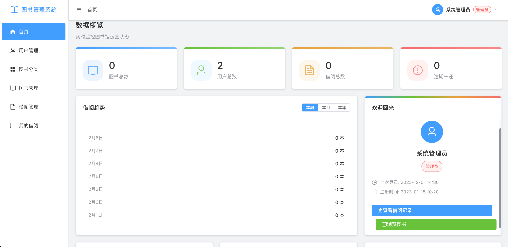
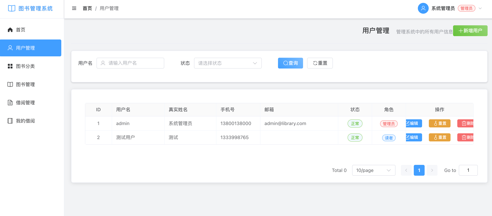
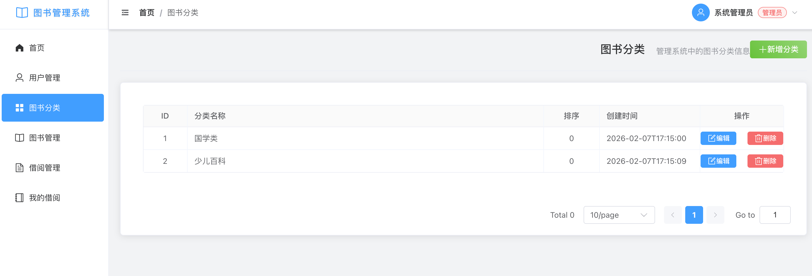
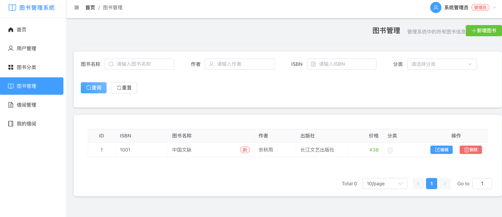
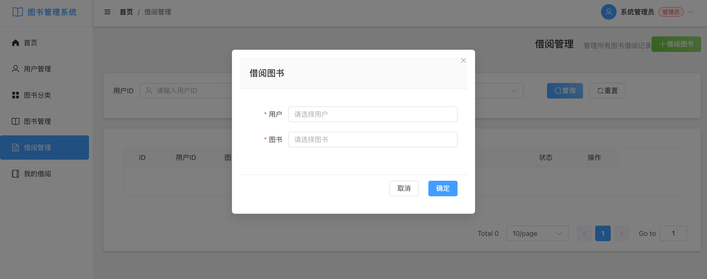
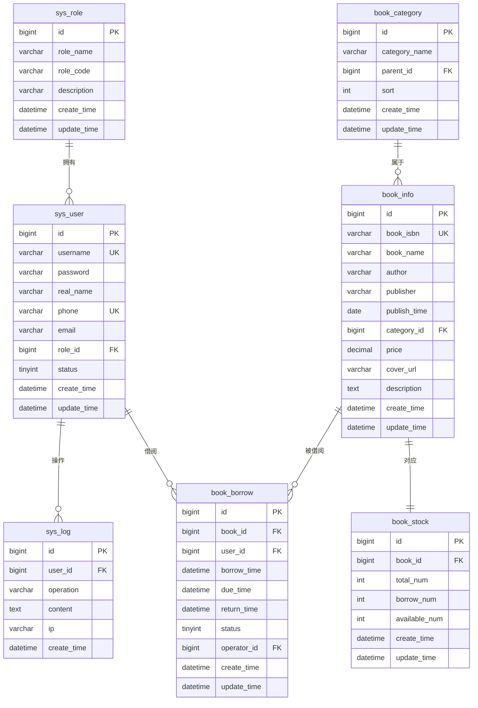

# 图书管理系统

基于 Vue 3 + SpringBoot 3.x + MySQL 的图书管理系统，提供完整的图书借阅管理功能。

## 目录

- [项目简介](#项目简介)
- [技术栈](#技术栈)
- [系统架构](#系统架构)
- [数据库设计](#数据库设计)
- [功能模块](#功能模块)
- [系统界面](#系统界面)
- [项目结构](#项目结构)
- [快速开始](#快速开始)
- [API 接口](#api-接口)
- [默认账号](#默认账号)

## 项目简介

本系统是一个功能完善的图书管理系统，支持管理员和读者两种角色，涵盖图书信息管理、借阅管理、用户管理等核心功能。系统采用前后端分离架构，后端使用 SpringBoot 3.x + MyBatis-Plus，前端使用 Vue 3 + Element Plus，数据库使用 MySQL 8.x。

## 技术栈

### 后端技术
- **SpringBoot 3.x** - 基础框架
- **MyBatis/MyBatis-Plus** - 数据访问层
- **Spring Security** - 权限控制
- **MySQL 8.x** - 关系型数据库
- **Lombok** - 简化代码
- **JWT** - Token 认证

### 前端技术
- **Vue 3** - 前端框架
- **Element Plus** - UI 组件库
- **Vue Router** - 路由管理
- **Pinia** - 状态管理
- **Axios** - HTTP 请求
- **Vite** - 构建工具

### 开发工具
- **Maven** - 后端依赖管理
- **Postman** - 接口测试
- **Navicat** - 数据库管理

## 系统架构

### 后端架构分层

```
SpringBoot 后端
├── controller（控制器）：接收前端请求，返回响应
├── service（服务层）：核心业务逻辑处理
├── mapper（数据访问层）：MyBatis 映射接口，操作数据库
├── entity（实体层）：对应数据库表的实体类
├── dto（数据传输对象）：前后端交互的参数/返回对象
├── vo（视图对象）：前端展示专用对象
├── config（配置层）：MyBatis、Security 等配置
├── exception（异常处理）：全局异常捕获
└── utils（工具类）：通用工具（如日期、加密）
```

### 前端架构分层

```
Vue 前端
├── src/api（接口封装）：统一管理后端接口请求
├── src/components（公共组件）：复用组件（如分页、表单）
├── src/views（页面视图）：各功能模块页面
├── src/router（路由）：页面路由配置
├── src/store（Pinia）：全局状态管理
├── src/utils（工具类）：Axios 封装、通用方法
└── src/assets（静态资源）：样式、图片等
```

## 数据库设计

系统共包含 7 张核心数据表，涵盖用户权限、图书信息、借阅管理三大核心场景。

### 核心数据表

| 表名 | 说明 | 主要功能 |
|------|------|----------|
| sys_user | 用户表 | 存储系统用户（管理员、读者）信息 |
| sys_role | 角色表 | 存储角色信息，控制权限范围 |
| book_category | 图书分类表 | 对图书进行分类管理 |
| book_info | 图书信息表 | 存储图书基本信息 |
| book_stock | 图书库存表 | 单独存储库存信息 |
| book_borrow | 图书借阅表 | 存储借阅记录 |
| sys_log | 操作日志表 | 记录系统操作日志（可选） |

### 表结构说明

#### 1. 用户表（sys_user）
存储系统用户信息，区分管理员和读者角色。

| 字段名 | 类型 | 说明 | 约束 |
|--------|------|------|------|
| id | BIGINT | 主键 ID | PRIMARY KEY, AUTO_INCREMENT |
| username | VARCHAR(50) | 用户名 | UNIQUE, NOT NULL |
| password | VARCHAR(100) | 密码（BCrypt 加密） | NOT NULL |
| real_name | VARCHAR(50) | 真实姓名 | - |
| phone | VARCHAR(20) | 手机号 | UNIQUE |
| email | VARCHAR(100) | 邮箱 | - |
| role_id | BIGINT | 角色 ID（外键） | FOREIGN KEY → sys_role.id |
| status | TINYINT | 状态（0-禁用，1-正常） | DEFAULT 1 |
| create_time | DATETIME | 创建时间 | DEFAULT CURRENT_TIMESTAMP |
| update_time | DATETIME | 更新时间 | DEFAULT CURRENT_TIMESTAMP ON UPDATE CURRENT_TIMESTAMP |

#### 2. 角色表（sys_role）
存储角色信息，如管理员、普通读者。

| 字段名 | 类型 | 说明 | 约束 |
|--------|------|------|------|
| id | BIGINT | 主键 ID | PRIMARY KEY, AUTO_INCREMENT |
| role_name | VARCHAR(50) | 角色名称（如：管理员、读者） | NOT NULL |
| role_code | VARCHAR(20) | 角色编码（如：ADMIN、READER） | UNIQUE, NOT NULL |
| description | VARCHAR(200) | 角色描述 | - |
| create_time | DATETIME | 创建时间 | DEFAULT CURRENT_TIMESTAMP |
| update_time | DATETIME | 更新时间 | DEFAULT CURRENT_TIMESTAMP ON UPDATE CURRENT_TIMESTAMP |

#### 3. 图书分类表（book_category）
对图书进行分类管理，支持多级分类。

| 字段名 | 类型 | 说明 | 约束 |
|--------|------|------|------|
| id | BIGINT | 主键 ID | PRIMARY KEY, AUTO_INCREMENT |
| category_name | VARCHAR(50) | 分类名称 | NOT NULL |
| parent_id | BIGINT | 父分类 ID（支持多级分类） | FOREIGN KEY → book_category.id, DEFAULT 0 |
| sort | INT | 排序权重 | DEFAULT 0 |
| create_time | DATETIME | 创建时间 | DEFAULT CURRENT_TIMESTAMP |
| update_time | DATETIME | 更新时间 | DEFAULT CURRENT_TIMESTAMP ON UPDATE CURRENT_TIMESTAMP |

#### 4. 图书信息表（book_info）
核心表，存储图书基本信息。

| 字段名 | 类型 | 说明 | 约束 |
|--------|------|------|------|
| id | BIGINT | 主键 ID | PRIMARY KEY, AUTO_INCREMENT |
| book_isbn | VARCHAR(20) | ISBN 编号 | UNIQUE, NOT NULL |
| book_name | VARCHAR(100) | 图书名称 | NOT NULL |
| author | VARCHAR(50) | 作者 | - |
| publisher | VARCHAR(100) | 出版社 | - |
| publish_time | DATE | 出版时间 | - |
| category_id | BIGINT | 分类 ID | FOREIGN KEY → book_category.id |
| price | DECIMAL(10,2) | 图书定价 | - |
| cover_url | VARCHAR(500) | 封面图片 URL | - |
| description | TEXT | 图书简介 | - |
| create_time | DATETIME | 创建时间 | DEFAULT CURRENT_TIMESTAMP |
| update_time | DATETIME | 更新时间 | DEFAULT CURRENT_TIMESTAMP ON UPDATE CURRENT_TIMESTAMP |

#### 5. 图书库存表（book_stock）
单独存储库存，避免和图书基本信息耦合。

| 字段名 | 类型 | 说明 | 约束 |
|--------|------|------|------|
| id | BIGINT | 主键 ID | PRIMARY KEY, AUTO_INCREMENT |
| book_id | BIGINT | 图书 ID | FOREIGN KEY → book_info.id, UNIQUE, NOT NULL |
| total_num | INT | 总库存数量 | DEFAULT 0 |
| borrow_num | INT | 已借出数量 | DEFAULT 0 |
| available_num | INT | 可借数量 | DEFAULT 0 |
| create_time | DATETIME | 创建时间 | DEFAULT CURRENT_TIMESTAMP |
| update_time | DATETIME | 更新时间 | DEFAULT CURRENT_TIMESTAMP ON UPDATE CURRENT_TIMESTAMP |

#### 6. 图书借阅表（book_borrow）
存储借阅记录，核心业务表。

| 字段名 | 类型 | 说明 | 约束 |
|--------|------|------|------|
| id | BIGINT | 主键 ID | PRIMARY KEY, AUTO_INCREMENT |
| book_id | BIGINT | 图书 ID | FOREIGN KEY → book_info.id, NOT NULL |
| user_id | BIGINT | 借阅用户 ID | FOREIGN KEY → sys_user.id, NOT NULL |
| borrow_time | DATETIME | 借阅时间 | DEFAULT CURRENT_TIMESTAMP |
| due_time | DATETIME | 应归还时间 | NOT NULL |
| return_time | DATETIME | 实际归还时间 | - |
| status | TINYINT | 状态（0-未还，1-已还，2-逾期） | DEFAULT 0 |
| operator_id | BIGINT | 操作人 ID（管理员） | FOREIGN KEY → sys_user.id |
| create_time | DATETIME | 创建时间 | DEFAULT CURRENT_TIMESTAMP |
| update_time | DATETIME | 更新时间 | DEFAULT CURRENT_TIMESTAMP ON UPDATE CURRENT_TIMESTAMP |

#### 7. 操作日志表（sys_log）
记录系统操作日志，用于审计和问题排查。

| 字段名 | 类型 | 说明 | 约束 |
|--------|------|------|------|
| id | BIGINT | 主键 ID | PRIMARY KEY, AUTO_INCREMENT |
| user_id | BIGINT | 操作人 ID | FOREIGN KEY → sys_user.id |
| operation | VARCHAR(50) | 操作类型 | - |
| content | TEXT | 操作内容 | - |
| ip | VARCHAR(50) | 操作 IP | - |
| create_time | DATETIME | 操作时间 | DEFAULT CURRENT_TIMESTAMP |

## 功能模块

### 1. 系统管理模块（管理员专属）

| 功能项 | 详细说明 |
|--------|----------|
| 用户管理 | 新增/编辑/删除用户、重置密码、启用/禁用用户、查询用户列表（按角色/状态筛选） |
| 角色管理 | 新增/编辑/删除角色、为角色分配权限（如：管理员可操作图书，读者仅可借阅） |
| 操作日志查看 | 按时间/用户/操作类型查询日志、导出日志 |

### 2. 图书管理模块（管理员专属）

| 功能项 | 详细说明 |
|--------|----------|
| 图书分类管理 | 新增/编辑/删除分类、分类排序、查询分类列表 |
| 图书信息管理 | 新增图书（上传封面、填写基本信息）、编辑图书、删除图书、批量导入/导出图书 |
| 图书库存管理 | 调整库存数量、查看库存明细（总库存/已借出/可借）、库存预警（低于阈值提醒） |
| 图书查询 | 多条件查询（按名称/作者/ISBN/分类）、模糊搜索、分页展示 |

### 3. 借阅管理模块（管理员+读者）

| 功能项 | 详细说明 |
|--------|----------|
| 图书借阅（管理员） | 为读者办理借阅、选择图书+读者、自动计算应归还时间、更新库存 |
| 图书归还（管理员） | 办理归还、更新借阅状态、更新库存、标记逾期（如有） |
| 借阅记录查询（读者） | 查看自己的借阅记录、筛选（未还/已还/逾期）、查看应归还时间 |
| 借阅记录查询（管理员） | 按读者/图书/时间/状态查询所有借阅记录、导出记录、逾期提醒 |

### 4. 前台门户模块（读者专属）

| 功能项 | 详细说明 |
|--------|----------|
| 登录/注册 | 读者注册、账号密码登录、记住密码、忘记密码（邮箱/手机验证） |
| 图书浏览 | 首页展示热门图书、按分类浏览图书、图书详情页（查看简介/库存） |
| 个人中心 | 查看个人信息、修改密码、查看我的借阅记录 |

## 系统界面

### 系统截图

#### 1. 登录页面


#### 2. 管理主页


#### 3. 用户管理


#### 4. 图书分类


#### 5. 图书管理


#### 6. 借阅管理


### 数据库 ER 图



**ER 图说明：**
- **sys_role（角色表）**：与 sys_user 一对多关系，一个角色可以分配给多个用户
- **sys_user（用户表）**：与 book_borrow 一对多关系，一个用户可以有多条借阅记录；与 sys_log 一对多关系，记录用户操作日志
- **book_category（图书分类表）**：与 book_info 一对多关系，一个分类下可以有多本图书；支持自关联实现多级分类
- **book_info（图书信息表）**：与 book_stock 一对一关系，每本书对应一条库存记录；与 book_borrow 一对多关系，一本书可以被多次借阅
- **book_stock（图书库存表）**：与 book_info 一对一关系，单独存储库存信息
- **book_borrow（借阅记录表）**：关联图书和用户，记录借阅详情
- **sys_log（操作日志表）**：记录系统操作，用于审计和问题排查

## 项目结构

```
Library_demo/
├── library-backend/          # 后端项目
│   ├── src/
│   │   ├── main/
│   │   │   ├── java/com/library/
│   │   │   │   ├── controller/   # 控制器层
│   │   │   │   ├── service/      # 服务层
│   │   │   │   ├── mapper/       # 数据访问层
│   │   │   │   ├── entity/       # 实体类
│   │   │   │   ├── dto/          # 数据传输对象
│   │   │   │   ├── vo/           # 视图对象
│   │   │   │   ├── config/       # 配置类
│   │   │   │   ├── exception/    # 异常处理
│   │   │   │   └── utils/        # 工具类
│   │   │   └── resources/
│   │   │       ├── application.yml
│   │   │       └── schema.sql
│   │   └── test/
│   └── pom.xml
│
└── library-frontend/         # 前端项目
    ├── src/
    │   ├── api/               # API 接口封装
    │   ├── components/        # 公共组件
    │   ├── views/             # 页面组件
    │   ├── router/            # 路由配置
    │   ├── store/             # 状态管理
    │   ├── utils/             # 工具类
    │   ├── assets/            # 静态资源
    │   ├── App.vue
    │   └── main.js
    ├── package.json
    └── vite.config.js
```

## 快速开始

### 环境要求

- JDK 17+
- Node.js 16+
- MySQL 8.0+
- Maven 3.6+

### 数据库配置

1. 确保已安装 MySQL 8.0
2. 创建数据库并执行 SQL 脚本：
   ```bash
   mysql -u root -p < library-backend/src/main/resources/schema.sql
   ```
3. 复制配置模板并修改数据库配置：
   ```bash
   cp library-backend/src/main/resources/application-template.yml library-backend/src/main/resources/application.yml
   ```
4. 编辑 [application.yml](file:///Users/torres/Documents/trae_projects/Library_demo/library-backend/src/main/resources/application.yml)，填写您的数据库密码和 JWT 密钥

**注意：** `application.yml` 文件包含敏感信息，已被 .gitignore 排除，不会被上传到 GitHub。

### 后端启动

1. 进入后端目录：
   ```bash
   cd library-backend
   ```

2. 使用 Maven 启动：
   ```bash
   mvn spring-boot:run
   ```

后端服务将在 http://localhost:8080 启动

### 前端启动

1. 进入前端目录：
   ```bash
   cd library-frontend
   ```

2. 安装依赖（如果尚未安装）：
   ```bash
   npm install
   ```

3. 启动开发服务器：
   ```bash
   npm run dev
   ```

前端服务将在 http://localhost:5173 启动

## API 接口

### 认证接口
- POST `/api/auth/login` - 用户登录

### 用户管理
- GET `/api/user/list` - 获取用户列表
- GET `/api/user/{id}` - 获取用户详情
- POST `/api/user` - 新增用户
- PUT `/api/user` - 更新用户
- DELETE `/api/user/{id}` - 删除用户
- PUT `/api/user/reset-password/{id}` - 重置密码

### 图书分类
- GET `/api/category/list` - 获取分类列表
- GET `/api/category/all` - 获取所有分类
- POST `/api/category` - 新增分类
- PUT `/api/category` - 更新分类
- DELETE `/api/category/{id}` - 删除分类

### 图书管理
- GET `/api/book/list` - 获取图书列表
- GET `/api/book/{id}` - 获取图书详情
- POST `/api/book` - 新增图书
- PUT `/api/book` - 更新图书
- DELETE `/api/book/{id}` - 删除图书

### 借阅管理
- GET `/api/borrow/list` - 获取借阅记录列表
- GET `/api/borrow/my-borrows` - 获取我的借阅记录
- POST `/api/borrow` - 借阅图书
- PUT `/api/borrow/return/{id}` - 归还图书

## 默认账号

- **管理员账号**：`admin` / `123456`
  - 角色：管理员（ADMIN）
  - 权限：系统管理、图书管理、借阅管理

- **读者账号**：`reader` / `123456`
  - 角色：读者（READER）
  - 权限：图书浏览、个人借阅记录查询

## 注意事项

1. 首次运行前请确保 MySQL 服务已启动
2. 修改数据库密码后需同步更新 [application.yml](file:///Users/torres/Documents/trae_projects/Library_demo/library-backend/src/main/resources/application.yml) 配置
3. 前端默认连接后端地址为 http://localhost:8080，如需修改请更新 [request.js](file:///Users/torres/Documents/trae_projects/Library_demo/library-frontend/src/utils/request.js)
4. 系统使用 BCrypt 加密存储用户密码，请确保密码安全性
5. 数据库表使用 `utf8mb4` 字符集，支持 emoji 和特殊字符
6. 为高频查询字段添加了索引，提升查询效率

## 技术亮点

- **前后端分离**：采用前后端分离架构，便于开发和维护
- **权限控制**：基于 Spring Security + JWT 实现细粒度权限控制
- **数据一致性**：通过外键约束和事务管理保证数据一致性
- **性能优化**：为高频查询字段添加索引，使用 MyBatis-Plus 简化 CRUD 操作
- **用户体验**：使用 Element Plus 提供美观的 UI 界面，支持分页、搜索等功能
